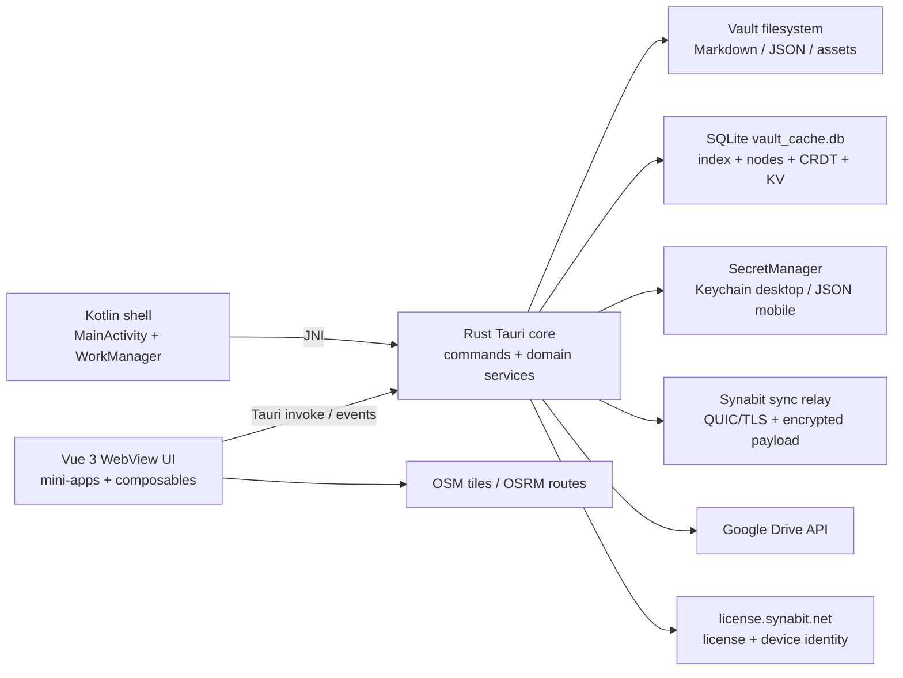

# Synabit Android — Architecture, Code, Data, UI/UX & Google Play Readiness Audit

**Ngày audit:** 22/07/2026  
**Snapshot:** branch `main`, commit nền `332309e`, version `0.9.3` / versionCode `9003`  
**Package:** `com.synabit.app`  
**Kết luận:** **NO-GO — chưa sẵn sàng đưa lên Google Play**  
**Điểm readiness ước lượng:** **32/100**

> Điểm số là thước đo ưu tiên kỹ thuật, không phải chứng nhận chính thức của Google. Snapshot đang có một refactor sync lớn chưa commit (43 file đã sửa/xóa, thêm nhiều file mới, khoảng 8.425 dòng xóa và 264 dòng thêm). Không nên dùng chính working tree này làm release candidate.

## 1. Executive summary

Synabit có nền tảng sản phẩm tốt: UI nhất quán, local-first, code dùng Vue 3 + TypeScript + Tauri 2 + Rust, target API hiện đại, cleartext bị tắt ở release, sync có E2EE dùng primitive tốt, OAuth có PKCE, SQLite dùng WAL/FTS5 và có CRDT compaction. Bản debug cũ cũng khởi động được trên emulator Android 16 KB page-size.

Tuy nhiên app chưa ở trạng thái có thể submit. Các blocker chính:

1. **Không tạo được AAB từ source hiện tại.** Lệnh Tauri Android build thất bại lặp lại trong build script của `tauri-plugin-fs`; repo cũng không có AAB release nào.
2. **Release pipeline chưa tồn tại:** không có Android CI, không có release signing config/upload key, không có artifact để kiểm tra bằng Play Console.
3. **Background sync Android đang hỏng ở cả wiring lẫn implementation:** Kotlin load sai tên native library, JNI chỉ log rồi kết thúc, worker vẫn báo success, lịch 15 phút không khớp UI và được enqueue vô điều kiện.
4. **Mobile secrets không dùng Android Keystore như privacy policy tuyên bố.** E2EE key, OAuth/sync config và PIN hash được ghi plaintext vào `synabit_secrets.json`; app còn chưa cấu hình loại dữ liệu này khỏi Android Auto Backup.
5. **Privacy policy/Data Safety không khớp hành vi thực tế.** App tự kết nối `sync.synabit.net`, license server nhận HWID/device name, map routing gửi tọa độ, Google Drive có restricted scope, trong khi policy nói dữ liệu chỉ ở local và không truyền/store trên server.
6. **Luồng Pro/license chưa an toàn cho phân phối toàn cầu trên Play.** App mở `synabit.net/pricing` để mua tính năng số nhưng không có Play Billing hay điều kiện vùng/chương trình phù hợp.
7. **Quality gates đang đỏ:** TypeScript typecheck lỗi khoảng 80 lỗi, Rust tests không compile, unit test frontend fail, Android Lint có 2 errors/34 warnings, npm audit có 5 vulnerability.
8. **Tauri capability quá rộng:** renderer được cấp đọc/ghi filesystem và mở path `**`. Đây là trust boundary nguy hiểm khi app đồng thời render HTML từ RSS/content.
9. **Accessibility mobile chưa đạt:** 713 `<button>` nhưng không có `aria-label`; snapshot UI Automation chỉ thấy một WebView không có cây control semantic; modal không có dialog/focus semantics.

Với trạng thái hiện tại, submit ngay có khả năng bị chặn từ trước upload (không có AAB), bị reject policy/billing/privacy, hoặc phát hành một app có feature sync không hoạt động và rủi ro mất/lộ dữ liệu.

## 2. Scope và phương pháp

Đã audit:

- Kiến trúc frontend, Tauri command boundary, Rust core, Android wrapper, sync server và license flow.
- Schema SQLite, filesystem vault, local secrets, SharedPreferences và các luồng dữ liệu remote.
- Static review UI, responsive mobile layout, accessibility semantics.
- Build/typecheck/unit test/Rust check & test/Android Lint/npm audit.
- Manifest, merged permissions, signing, AAB/APK, ABI, 16 KB alignment, kích thước package.
- Smoke test bản debug sẵn có trên emulator Android arm64 16 KB và quan sát log/runtime/UI.
- Đối chiếu các yêu cầu Google Play công khai tại ngày audit.

Chưa thể xác minh:

- Play Console, developer account, Data Safety draft, OAuth consent screen/verification và Play App Signing thực tế.
- Production server hardening, retention/backups/incident response của sync và license server.
- Release AAB vì build hiện tại thất bại.
- Thiết bị vật lý, tablet/foldable, Android 7–15, battery/Doze dài hạn, TalkBack thủ công, network loss và restore-from-backup.
- Giá trị secret trong `.env`/`src-tauri/secrets`; audit chỉ kiểm tra tên biến và tracking status, không đọc giá trị. Thư mục secrets và `.env` hiện không được Git track.

Smoke test dùng APK debug có sẵn được build sớm hơn snapshot refactor hiện tại. Kết quả UI/runtime của APK đó là bằng chứng tham khảo, không chứng minh source hiện tại chạy được.

## 3. Release verdict và scorecard

| Hạng mục | Điểm | Trạng thái | Nhận xét ngắn |
|---|---:|---|---|
| Kiến trúc & maintainability | 52/100 | Cần cải thiện | Stack hợp lý nhưng app shell/feature files quá lớn, boundary stringly typed, refactor sync đang dở |
| Source quality & testing | 25/100 | Blocker | Typecheck, Rust tests, frontend unit test và Android Lint đều fail |
| Data integrity & migrations | 45/100 | Rủi ro cao | Data model có nền tảng tốt nhưng migration ad-hoc, thiếu FK/schema version toàn cục/restore test |
| Security & privacy | 22/100 | Blocker | Plaintext secrets, backup mặc định, capability `**`, policy sai với runtime |
| Android engineering | 28/100 | Blocker | Background worker no-op, sai native lib, thiếu release signing/AAB |
| UI/UX | 60/100 | Cần cải thiện | Visual khá polished; mobile information density, gesture, overlay và navigation còn vấn đề |
| Accessibility | 15/100 | Blocker chất lượng | Thiếu accessible names/dialog semantics; WebView tree không được expose trong smoke test |
| Google Play compliance | 25/100 | Blocker | Billing/privacy/Data Safety/release artifacts chưa đạt; target SDK đạt |

**Quyết định:** chỉ chuyển sang internal testing sau khi toàn bộ P0 được đóng. Không nên tạo production release trước closed test và data-loss/security test.

## 4. Kiến trúc hệ thống

### 4.1 Sơ đồ hiện tại

### 4.2 Điểm tốt

- Tauri/Rust cho phép dùng chung core đa nền tảng và giữ file/database logic ngoài renderer.
- Router lazy-load mini-app; production build thực sự tách feature chunks.
- Rust error type và path-safety helper được dùng ở nhiều file operation; có test traversal/symlink ở một số đường dẫn.
- Sync crypto dùng XChaCha20-Poly1305, random nonce, Argon2 và có epoch/version; có zeroization ở một số buffer/key path.
- SQLite bật WAL, có index cho node/edge/update, FTS5 được version riêng, CRDT update có compaction theo transaction.
- CSP không cho inline script/eval; cleartext traffic bị tắt ở release.

### 4.3 Vấn đề kiến trúc

#### A-01 — App shell và feature monolith quá lớn — P1

- Codebase khoảng 71,6k LOC; có 137 Vue, 93 TypeScript và 87 Rust files.
- `src/App.vue` khoảng 927 dòng và đang điều phối navigation, lock, updater, sync, lifecycle và nhiều global event.
- Các file như Settings, Quick Capture, Finance, Whiteboard/Note và Rust node/feed/tool commands thường vượt 1.000 dòng.
- Pinia chỉ quản lý một phần nhỏ; nhiều state/lifecycle nằm trong component/composable lớn, khiến race condition và regression mobile khó kiểm soát.

**Khuyến nghị:** tách application shell thành services có interface rõ (`SyncService`, `VaultService`, `LicenseService`, `UpdateService`); mỗi mini-app sở hữu store/router boundary riêng; giới hạn component khoảng 300–500 dòng và command module theo bounded context.

#### A-02 — IPC stringly typed và type safety chưa được enforce — P1

Frontend gọi nhiều command bằng chuỗi và dùng `any`. Dù `tsconfig` strict, script production chỉ chạy `vite build`; Vite transpile thành công trong khi `vue-tsc --noEmit` đang lỗi khoảng 80 lỗi. Vì vậy build xanh không có nghĩa code type-safe.

**Khuyến nghị:** generate typed bindings từ Rust command types hoặc ít nhất gom tất cả invoke/event vào một typed gateway; CI bắt buộc chạy `vue-tsc`, ESLint và contract tests.

#### A-03 — Refactor sync chưa có stable boundary — P0

Working tree đang xóa phần lớn P2P/sync engine cũ và thêm coordinator/core/adapter mới. `cargo check` pass nhưng test module mới không compile. README vẫn mô tả “serverless P2P” trong khi runtime tự kết nối relay trung tâm.

**Khuyến nghị:** freeze feature, tách refactor vào branch/PR riêng, viết compatibility/data migration plan, chốt terminology “sync relay” thay vì P2P nếu kiến trúc đã đổi, và chỉ cut release từ clean tagged commit.

## 5. Source code và security findings

### SEC-01 — Secrets mobile được lưu plaintext — P0 / High

[`src-tauri/src/secrets.rs`](../src-tauri/src/secrets.rs) ghi toàn bộ `AppSecrets` thành JSON trong app data trên Android/iOS. File có thể chứa:

- E2EE password/key.
- Google Drive/sync token/config.
- Vault tokens.
- Argon2 PIN hash, protected app/note list và auto-lock config.

Privacy policy lại tuyên bố token được lưu trong Android Keystore. Đây vừa là security defect, vừa là inaccurate disclosure.

**Impact:** malware/root/debug backup/forensic access hoặc một bug file-read trong app có thể lấy refresh token và E2EE key. App Lock chỉ che UI, không mã hóa local vault/database.

**Fix bắt buộc:** tạo master key non-exportable trong Android Keystore, AES-GCM encrypt secret blob với random nonce và authenticated metadata; lưu cipher trong `noBackupFilesDir`; migrate và xóa an toàn file plaintext cũ; test device lock, key invalidation, backup/restore và app upgrade. Không lưu E2EE password sau khi derive key nếu không thực sự cần.

### SEC-02 — Android Auto Backup chưa được kiểm soát — P0 / High

Manifest không đặt `android:allowBackup` và không có `dataExtractionRules`/`fullBackupContent`, nên app dùng hành vi backup mặc định. Với plaintext secret và SQLite content, đây là rủi ro restore/copy dữ liệu ngoài model threat hiện tại.

**Fix bắt buộc:** quyết định rõ dữ liệu nào được backup; loại secret, token, key, database nhạy cảm và vault cache khỏi cloud/device transfer. Nếu tắt toàn bộ backup, khai báo và test trên API cũ/mới; nếu cho backup content, encrypt content bằng key có recovery design rõ ràng.

### SEC-03 — Tauri capability và asset scope cấp `**` — P0 / High

[`src-tauri/capabilities/default.json`](../src-tauri/capabilities/default.json) cấp `fs:write-all`, filesystem read/write và opener path cho `**`, áp dụng cho window `*`. [`src-tauri/tauri.conf.json`](../src-tauri/tauri.conf.json) cũng bật asset protocol scope `**`.

**Impact:** một renderer compromise/XSS hoặc dependency compromise có thể biến thành đọc/ghi/mở file ngoài vault, phá vỡ toàn bộ path validation viết ở Rust command layer.

**Fix bắt buộc:** tạo capability riêng theo platform/window; mobile không có `write-all`; chỉ allow app data/vault path người dùng đã chọn; bỏ generic opener path; mọi destructive write đi qua Rust command có canonicalize, allowlist và audit log. Asset protocol chỉ scope đúng thư mục cần preview.

### SEC-04 — Remote HTML và dependency vulnerabilities — P1 / High

- RSS article content được render trực tiếp bằng `v-html` trong `ArticleReader.vue` mà không sanitize.
- Project content cũng có đường `v-html` không sanitize.
- `npm audit --omit=dev` tại ngày audit báo 5 package có advisory: 3 high, 2 moderate; gồm `linkify-it`, `undici`, `vite`, `markdown-it`, và direct `dompurify`.
- DOMPurify được dùng đúng ở một số feature, nhưng version hiện tại có nhiều advisory và policy sanitize không tập trung.

CSP hiện tại giảm một phần khả năng chạy inline script, nhưng không nên xem CSP là sanitizer, nhất là khi native capability quá rộng.

**Fix:** nâng dependency đến version đã vá; mọi untrusted HTML đi qua một sanitizer service duy nhất với allowlist tối thiểu; strip iframe/form/style/event/unsafe URI; parse RSS trong isolated representation; thêm corpus test XSS/mXSS/large-input DoS.

### SEC-05 — OAuth mobile/deep link cần hardening — P1

- App có hai intent-filter giống nhau cho custom scheme `com.synabit.app`.
- Custom scheme có thể bị app khác claim; PKCE giảm nguy cơ lấy code nhưng không giải quyết UX spoofing/redirect ambiguity.
- `drive.readonly` là restricted Drive scope; production app phải qua verification tương ứng.
- `CLIENT_SECRET` desktop được compile không điều kiện trong module chung, nên có nguy cơ nằm trong Android binary dù mobile exchange không cần nó.
- PKCE verifier được lưu tạm trong SQLite KV plaintext.

**Fix:** dùng Android OAuth client riêng cho production, verified HTTPS App Link hoặc thư viện AppAuth/Google flow phù hợp; giới hạn host/path; xóa intent-filter trùng; cfg-gate hoàn toàn desktop secret; lưu verifier trong memory/secure ephemeral storage; chuẩn bị OAuth verification và policy URL trên verified domain. Google yêu cầu client riêng theo platform và verification cho sensitive/restricted scopes: [OAuth 2.0 Policies](https://developers.google.com/identity/protocols/oauth2/policies), [Drive scopes](https://developers.google.com/workspace/drive/api/guides/api-specific-auth).

### SEC-06 — FileProvider expose toàn external storage — P1

`file_paths.xml` khai báo `<external-path path="." />`. Provider không exported và cần URI grant nên không phải public read trực tiếp, nhưng blast radius quá lớn nếu renderer/native share flow bị lợi dụng.

**Fix:** chỉ expose một app-specific export/share directory; copy file được user chọn vào đó; grant read-only URI ngắn hạn.

### SEC-07 — Local data không encrypted-at-rest — P1

Vault files và `vault_cache.db` là plaintext. E2EE hiện bảo vệ payload sync, không bảo vệ local device. Marketing/privacy/README cần nói rõ điều này; “App Lock” không được mô tả như data encryption.

**Fix:** hoặc minh bạch threat model “OS sandbox only”, hoặc triển khai encrypted vault/database với recovery/export design. Không nên thêm SQLCipher riêng lẻ nếu Markdown/assets vẫn plaintext.

### SEC-08 — Update flow không có Android platform guard — P1

`useAppUpdate()` tự check GitHub updater sau 10 giây và có `downloadAndInstall()`, không thấy guard Android. Bản Play nên nhận update qua Google Play, không dùng desktop updater path.

**Fix:** disable Tauri updater/process capability trên Android build; dùng [Play In-App Updates](https://developer.android.com/guide/playcore/in-app-updates) nếu cần prompt flexible/immediate.

## 6. Android native và background execution

### AND-01 — Background sync không hoạt động — P0

Ba lỗi độc lập:

1. `SyncWorker.kt` gọi `System.loadLibrary("synabit")`, nhưng APK chứa `libsynabit_lib.so` do Rust `[lib] name = "synabit_lib"`.
2. Sau khi load fail, worker vẫn có thể gọi native method; `UnsatisfiedLinkError` là `Error`, không được catch bởi `catch (Exception)`.
3. JNI `runHeadlessSync` chỉ tạo Tokio runtime và log “Connecting”; comment ghi rõ `Headless sync logic to be implemented`. Nó không sync gì nhưng Kotlin trả `Result.success()`.

Ngoài ra worker chỉ đọc vault path/server address/server ID từ plaintext SharedPreferences, không có E2EE key/token đầy đủ để thực thi pipeline hiện tại.

**Fix bắt buộc:** nếu chưa thể làm đúng, tắt/remove background sync và mọi copy “background sync” khỏi release đầu. Nếu giữ feature: thống nhất library/JNI symbol, trả typed result/error, reuse cùng coordinator với foreground, inject secure credentials, idempotency + lock, retry/backoff, cancellation, telemetry cục bộ, và instrumentation test thật qua process restart/Doze/network loss.

### AND-02 — Scheduling không phản ánh setting — P0

`MainActivity` enqueue periodic worker mỗi lần activity tạo, bất kể user bật/tắt sync. Chu kỳ hard-code 15 phút; UI cho nhập 1–60 phút và mặc định foreground là 5 phút. WorkManager periodic minimum là 15 phút, nên các giá trị 1–14 không thể được thực hiện như người dùng hiểu.

**Fix:** enqueue/cancel unique work khi setting thay đổi; UI clamp 15+ cho background; tách foreground timer và background work bằng wording rõ; thực thi cellular/unmetered constraint đúng với setting; không schedule cho user chưa consent/kết nối provider.

### AND-03 — Manifest tự nhận Android TV nhưng app không hoàn chỉnh cho TV — P0 build quality

Manifest thêm `LEANBACK_LAUNCHER` và leanback feature. Android Lint fail vì thiếu TV banner và không mark touchscreen optional. UI hiện touch/WebView-centric, không có D-pad/focus test.

**Fix nhanh:** bỏ toàn bộ Leanback launcher/TV declaration khỏi phone release. Chỉ thêm lại khi có track TV, banner, D-pad navigation và TV QA.

### AND-04 — Notification permission flow chưa thấy — P1

Merged manifest có `POST_NOTIFICATIONS`, nhưng source không thấy runtime permission request trước các Rust notification. Trên Android 13+, notification có thể im lặng fail/không hiện.

**Fix:** contextual permission request sau khi user bật notification feature; giải thích benefit; app phải hoạt động bình thường nếu từ chối; test channel/settings/deeplink.

### AND-05 — Android Lint fail — P0 gate

`./gradlew :app:lintArmDebug` cho kết quả **2 errors, 34 warnings, 1 hint**:

- Errors: thiếu TV banner, touchscreen requirement không phù hợp Leanback.
- Warnings đáng chú ý: round icon không tròn, density size không nhất quán, duplicate icons, dependency cũ, Java/Kotlin target 1.8 với JDK 21, generated WebView deprecation.

Không được baseline để giấu hai errors; sửa manifest/icon và giữ lint zero-error trong CI.

## 7. Cấu trúc dữ liệu và data integrity

### 7.1 Các lớp lưu trữ

| Layer | Dữ liệu | Vai trò | Rủi ro chính |
|---|---|---|---|
| Vault filesystem | Markdown/JSON/assets và content feature | Portable/user-owned source | Plaintext, delete/rename conflict, backup/recovery chưa rõ |
| `vault_cache.db` | nodes, edges, blocks, files, whiteboards, FTS, CRDT, KV | Index/cache + một phần operational state | Plaintext, schema migration ad-hoc, có duplicate source-of-truth |
| `synabit_secrets.json` mobile | E2EE key, OAuth/sync config, PIN hash | Secret/config | Plaintext, backup risk |
| Tauri store | `settings.json` | UI/app settings | Không phù hợp secret |
| Android SharedPreferences | vault/server config | Headless worker bridge | Plaintext, thiếu key/token và lifecycle |
| Synabit relay | encrypted operations + routing/mailbox metadata | Cross-device sync | Privacy disclosure/retention/abuse controls chưa audit |
| Google Drive | vault files và/hoặc all-file browse | Optional cloud integration | Scope verification, token security, conflict recovery |
| License server | license, HWID, device name, heartbeat | Trial/subscription enforcement | Personal/device data disclosure & deletion |

### 7.2 SQLite schema

[`src-tauri/src/db/schema.rs`](../src-tauri/src/db/schema.rs) tạo:

- `files`, `file_sources`.
- Universal `nodes` với `node_type`, title/content/properties, text/integer timestamps.
- `node_blocks`, `node_edges`.
- `whiteboards`.
- `kv_store` cho OAuth state/settings.
- `crdt_documents`, `crdt_updates`, `document_paths`.
- FTS5 `search_index`, version riêng bằng key `fts_schema_version`.

### 7.3 Điểm tốt

- Index đúng cho node type/timestamp, edge direction/type và CRDT doc ID.
- FTS rebuild được version; incremental update tồn tại.
- CRDT update compaction chạy transaction và giới hạn history khi sync.
- Nhiều sync apply path dùng temporary file + rename để giảm partial write.

### 7.4 Data findings

#### DATA-01 — Không có migration framework/version toàn schema — P1

Migration hiện là `CREATE TABLE IF NOT EXISTS`, legacy cleanup và một số `ALTER`/ignore-error. Chỉ FTS có version. Không có `PRAGMA user_version` hoặc migration ledger, transaction bao toàn upgrade, pre-migration backup và rollback.

**Impact:** upgrade bị gián đoạn có thể để schema/data nửa cũ nửa mới; khó tái hiện và support downgrade.

**Fix:** numbered migrations, mỗi migration transaction + invariant check; backup trước destructive migration; golden upgrade tests từ mọi version đang support; không support downgrade thì detect và báo rõ.

#### DATA-02 — Referential integrity yếu — P1

`node_blocks`, `node_edges`, `crdt_updates`, `document_paths` không có foreign key/cascade; không thấy bật `PRAGMA foreign_keys=ON`. JSON/text columns không có shape validation; timestamps dùng cả TEXT và INTEGER.

**Fix:** định nghĩa ownership/cascade, bật FK, thêm cleanup/integrity job, chuẩn hóa timestamp UTC integer hoặc ISO8601, validate versioned JSON properties ở Rust boundary.

#### DATA-03 — Nhiều source-of-truth — P1

Content có thể tồn tại ở vault files, `nodes.content`, whiteboards table, FTS và CRDT snapshot/update. Cần chỉ rõ cái nào authoritative, cái nào derived và thứ tự recovery sau crash/conflict.

**Fix:** document state machine cho create/edit/rename/delete/sync; derived DB phải rebuild được từ vault hoặc có journal nhất quán; thêm fault-injection tests tại từng bước write/rename/DB commit.

#### DATA-04 — Delete/recovery UX chưa đủ — P1

Một số flow dùng confirm rồi xóa trực tiếp. Với knowledge vault đa thiết bị, delete tombstone, undo/trash, retention và propagation phải được định nghĩa để tránh xóa lan truyền không thể phục hồi.

**Fix:** trash + restore window, explicit permanent delete, sync tombstone versioning, conflict UI và tested restore/export.

## 8. UI/UX audit trên Android

### 8.1 Điểm tốt

- Visual language khá nhất quán: typography, cards, spacing, light/dark tokens, empty-state và trạng thái connected.
- Daily Note có hierarchy rõ, editor dễ hiểu và contrast chính tốt.
- Quick Capture cards và FAB cho cảm giác sản phẩm đã được chăm chút.
- Edge-to-edge/safe-area nhìn đúng trên emulator đã test; cold launch activity khoảng 407 ms trên môi trường test.
- Bottom navigation tạo mental model đơn giản cho 7 tool chính.

### 8.2 Findings

#### UX-01 — Accessibility semantics gần như chưa có — P0 quality

Static count trong `src`:

- 713 `<button>` qua 114 Vue files.
- 0 `aria-label`.
- 29 `` nhưng chỉ 10 `alt`.
- 182 inputs và 112 labels; nhiều label không có `for/id` rõ.
- 0 `role="dialog"`, `aria-modal` hoặc focus-trap usage.

UI Automation snapshot của APK test chỉ expose một node WebView `NAF=true`, không có child control tree. Cần manual TalkBack để xác nhận, nhưng static evidence đã đủ cho thấy icon-only navigation/toolbars sẽ không có tên và modal không quản lý focus.

**Fix:** mọi icon button có accessible name/state; semantic heading/nav/main/dialog; label binding; focus trap/restore; keyboard/D-pad order; live region cho sync/error; test TalkBack, font scale 200%, switch access và external keyboard. Thêm axe/playwright accessibility test cho renderer.

#### UX-02 — Navigation bằng swipe xung đột content — P1

[`src/layouts/MobileLayout.vue`](../src/layouts/MobileLayout.vue) bắt swipe ngang trên toàn main area để chuyển giữa 7 tool. Gesture này có thể đụng editor selection, canvas/whiteboard, graph/map và nested horizontal content.

**Fix:** bỏ global swipe hoặc chỉ kích hoạt từ edge/empty shell; child interactive surface phải opt-out; có animation + back behavior thống nhất.

#### UX-03 — Bottom bar và viewport sizing — P1

Layout dùng `h-screen`, hard-code top padding tối thiểu 36 px và bottom nav 64 px. Trong Quick Capture smoke test, nav che phần cuối danh sách/scroll; FAB gần bar, scrollbar đè content. `100vh` trong WebView/keyboard cũng dễ gây resize lỗi.

**Fix:** dùng dynamic viewport (`100dvh`), central safe-area token, content `padding-bottom` bằng nav + inset, keyboard inset handling, test gesture nav/3-button nav/landscape.

#### UX-04 — Information density trên Nexus — P1

Search placeholder bị clip, back/forward icon contrast thấp; graph/node labels rất nhỏ trong vùng trống lớn. Trên phone, graph không truyền được thông tin và chiếm không gian của hành động chính.

**Fix:** phone-first mode dùng search/recent/result list; graph là tab/expand riêng; touch target tối thiểu khoảng 48 dp; tăng contrast và label scaling.

#### UX-05 — Settings modal chưa phải mobile-native flow — P1

Settings là modal 95vw × 90vh với tab icon ngang, không có dialog semantics và chứa rất nhiều config kỹ thuật (server address/ID, provider, interval). Trên phone nên là settings screen có route/back stack, section labels và progressive disclosure.

#### UX-06 — Feedback và terminology chưa nhất quán — P1

UI vừa dùng “P2P”, “Sync Server”, “Official Relay”; README lại nói serverless. “Periodic Auto Sync” không nói foreground/background và interval 5 phút không khớp WorkManager. Người dùng không thể hiểu dữ liệu đi đâu.

**Fix:** một taxonomy duy nhất; màn hình sync phải nói provider, last success, next run, data scope, encryption và server metadata; error phải actionable.

## 9. Build, test, dependency và performance evidence

| Check | Kết quả | Ý nghĩa |
|---|---|---|
| `npm run build` | Pass | Renderer transpile/bundle được |
| `npx vue-tsc --noEmit` | **Fail ~80 lỗi** | Type safety chưa đạt; có cả mismatch API/model thực |
| `npm run test:unit -- --run` | **Fail 1/3 tests** | Chỉ 2 test files; coverage cực thấp |
| `cargo check --manifest-path src-tauri/Cargo.toml --lib` | Pass, 27 warnings | Rust library compile cho host |
| `cargo test ... --lib` | **Fail compile** | Test mới thiếu `DocSyncPayload` import; không chạy được suite |
| `./gradlew :app:lintArmDebug` | **Fail: 2 errors, 34 warnings** | Android release gate đỏ |
| `npx tauri android build --aab --target aarch64 --ci` | **Fail lặp lại** | Không có release AAB; lỗi build script `tauri-plugin-fs` tạo `.tauri/tauri-api` với `File exists (os error 17)` |
| `npm audit --omit=dev` | **5 vulnerabilities** | 3 high, 2 moderate, đều có fix available |
| `cargo audit` | Không chạy được | `cargo-audit` chưa cài; cần thêm advisory scan CI |
| Existing debug APK smoke | Pass có điều kiện | APK cũ mở được; không đại diện source hiện tại |
| `zipalign -c -P 16` trên APK cũ | Pass | Packaging/native lib của APK cũ aligned 16 KB |

Các TypeScript lỗi tiêu biểu gồm model setting không khớp (`num_ctx`, `max_history_messages`), property `setTimeout` không tồn tại, async iterator mismatch, Tiptap node view/extension types, note/whiteboard edge/node types và nhiều unused symbol.

### Performance/package

- Production chunks rất lớn: Tiptap editor khoảng 1,57 MB minified; Note khoảng 1,06 MB; Mermaid/Wardley khoảng 615–617 KB; PDF worker khoảng 1,23 MB. Điều này tạo memory/parse pressure trên máy Android tầm trung.
- APK debug arm64 cũ là **966.708.661 bytes (~922 MiB)**; riêng `libsynabit_lib.so` khoảng 481 MB uncompressed do debug symbols. Không thể dùng size này để suy ra chính xác release AAB, nhưng nó cho thấy phải có size gate trước Play.
- Google Play giới hạn compressed download do AAB tạo cho mỗi thiết bị ở mức 200 MB; nếu vượt phải dùng Play Feature/Asset Delivery hoặc cắt feature. Xem [Create and set up your app](https://support.google.com/googleplay/android-developer/answer/9859152?hl=en).

**Khuyến nghị performance:** production symbol stripping; bundle analyzer budget; lazy-load editor/diagram/PDF only on demand; tách heavy feature; measure cold/warm start, memory, WebView main-thread stall và scroll jank trên 4 GB RAM device.

## 10. Google Play readiness checklist

| Yêu cầu | Trạng thái | Audit |
|---|---|---|
| Target API | **Pass** | `targetSdk=36`, `compileSdk=36`. Từ 31/08/2026 app mới/update phải target API 36: [official requirement](https://support.google.com/googleplay/android-developer/answer/11926878?hl=en-GB) |
| Min SDK | Pass về config | `minSdk=24`; chưa test device/API matrix |
| Android App Bundle | **Fail** | Không build được AAB; chỉ có debug APK arm64 |
| Release signing / Play App Signing | **Fail** | Không có `signingConfig`/upload key pipeline. Cần Play App Signing: [official guide](https://support.google.com/googleplay/android-developer/answer/9842756?hl=en) |
| 16 KB page size | Conditional pass | APK cũ chạy trên 16 KB emulator và zipalign pass; phải kiểm lại release AAB từ source hiện tại. Yêu cầu áp dụng app target Android 15+: [Android guide](https://developer.android.com/guide/practices/page-sizes) |
| 64-bit native | Conditional pass | APK cũ có arm64-v8a; kiểm tra final AAB ABI split |
| Android Lint | **Fail** | 2 errors |
| Runtime functionality | **Fail** | Background sync no-op/sai native lib |
| Permissions | Khá tốt | Direct permissions tương đối tối thiểu; cần notification consent. Không có SMS/call log/location runtime permission |
| Privacy policy URL | **Chưa đạt/không xác minh được** | Repo có markdown nhưng website repo không thấy public privacy route/link; nội dung hiện sai với code |
| Data Safety | **Fail/chưa chuẩn bị** | Mọi app đều phải khai form và privacy link, kể cả không collect: [Data Safety](https://support.google.com/googleplay/android-developer/answer/10787469?hl=en-EN) |
| Google OAuth verification | **Chưa đạt** | `drive.readonly` restricted; cần production brand/domain/privacy/verification |
| Payments/subscriptions | **Fail cho global release** | External pricing/license-key flow không có Billing/region program control |
| Subscription disclosure | **Fail** | App không hiển thị đầy đủ giá, chu kỳ, auto-renew, cách cancel/management trong flow Play |
| Account deletion | Conditional | Nếu license/email được xem là account hoặc app cho tạo account, cần in-app deletion path + web URL: [requirement](https://support.google.com/googleplay/android-developer/answer/13327111?hl=en) |
| Financial features declaration | Chưa làm | Tất cả published apps phải hoàn tất, kể cả chọn “không có financial features”: [official form](https://support.google.com/googleplay/android-developer/answer/13849271?hl=en-419) |
| Content rating / target audience / ads / app access | Chưa xác minh | Phải hoàn tất trong Play Console; app không thấy ad SDK |
| Closed testing | Có thể bắt buộc | Personal account tạo sau 13/11/2023 cần 12 testers liên tục 14 ngày: [testing requirement](https://support.google.com/googleplay/android-developer/answer/14151465?hl=en) |
| Store listing assets | Chưa sẵn sàng trong repo | Có launcher icon nhưng không thấy feature graphic/phone screenshots/store copy; icon còn lint warnings |
| Android CI & staged rollout | **Fail** | GitHub Actions chỉ desktop; chưa có internal/closed/staged Android flow |

### 10.1 Payments conclusion

App khóa chức năng Pro bằng trial/license và đưa link “Purchase one here” tới website. Với digital app functionality, Google Play Payments policy mặc định yêu cầu Play Billing, trừ exception hoặc chương trình/vùng áp dụng: [Payments policy](https://support.google.com/googleplay/android-developer/answer/9858738?hl=en), [policy overview](https://support.google.com/googleplay/android-developer/answer/10281818?hl=en).

Tại ngày audit, một số khu vực có lựa chọn external/alternative billing mở rộng, nhưng không thể hiển thị cùng một external purchase link toàn cầu mà không enroll, geofence và tuân thủ reporting/UX/fee của từng chương trình. Cách ít rủi ro nhất cho release đầu:

- Tích hợp Play Billing cho Android và verify entitlement server-side; hoặc
- Ship beta/free edition không có external purchase CTA/activation sale flow; hoặc
- Chỉ dùng external link ở đúng region/program đã đăng ký và có implementation policy-reviewed.

### 10.2 Privacy/Data Safety inventory phải khai

Trước khi điền Play Console, cần data inventory theo từng feature:

- License/trial: HWID, OS/device name, license key, heartbeat, có thể email/subscription data.
- Synabit relay: IP/network metadata, vault/device identifiers, encrypted operation/mailbox metadata, retention và deletion.
- Google Drive: OAuth token; file content/metadata tùy `drive.file` hoặc `drive.readonly`.
- Maps: route coordinates gửi tới public OSRM; tile request tới OpenStreetMap.
- Updates: GitHub request/version/device network metadata nếu giữ check.
- Ollama/local AI là local; bất kỳ cloud model/provider nào phải tách disclosure.

Privacy policy phải nói đúng collection, sharing, purpose, encryption in transit/at rest, retention, deletion, subprocessors và contact. “Encrypted content” không đồng nghĩa server không collect metadata.

## 11. P0 release blockers — thứ tự xử lý

1. **Tạo clean release branch/commit**; dừng release từ working tree refactor.
2. **Sửa AAB build**, tạo signed release AAB reproducibly trên clean CI.
3. **Quyết định background sync:** implement đúng end-to-end hoặc tắt hoàn toàn trong v1 Android.
4. **Migrate secrets sang Android Keystore** và cấu hình backup exclusion/data extraction rules.
5. **Thu hẹp Tauri capabilities/asset scope** trước khi xử lý remote HTML.
6. **Sửa privacy policy + Data Safety inventory** theo runtime/server thực tế và publish trên verified HTTPS domain.
7. **Chốt Android monetization:** Play Billing hoặc beta không bán Pro; remove global external CTA.
8. **Đưa toàn bộ quality gate về xanh:** `vue-tsc`, unit, Rust tests, Android Lint, dependency advisories.
9. **Bỏ Leanback/TV declaration** khỏi phone build hoặc hoàn thiện TV track.
10. **Accessibility pass tối thiểu:** names, dialogs/focus, TalkBack navigation, font scale.

## 12. Roadmap đề xuất

### Phase 0 — Release stabilization (1–2 ngày)

- Freeze refactor, clean branch, lock dependency/CLI versions.
- Reproduce AAB build trên clean machine/CI; sửa race/cache issue của Tauri plugin thay vì phụ thuộc xóa cache thủ công.
- Bỏ TV manifest; cấu hình signing qua CI secrets và Play upload key.
- Disable Android updater, background worker và external purchase CTA tạm thời nếu chưa hoàn thiện.

**Exit gate:** signed AAB build được từ clean checkout; lint zero error; install qua bundletool/internal app sharing.

### Phase 1 — Security/privacy (3–7 ngày, tùy migration)

- Keystore envelope encryption + plaintext migration + no-backup rules.
- Capability allowlist và FileProvider scope.
- Sanitize remote HTML, patch npm vulnerabilities, thêm cargo advisory scan.
- OAuth/deep-link hardening; tách Android OAuth client.
- Data inventory, privacy policy, retention/deletion docs.

**Exit gate:** security regression tests, backup/restore test, no plaintext token/key, policy/data flow review signed off.

### Phase 2 — Reliability/data (5–10 ngày)

- Hoàn thiện/loại background sync.
- Numbered DB migrations + upgrade fixtures + crash/fault tests.
- Sync conflict/delete/recovery tests; offline-first scenario matrix.
- Fix type errors và Rust/frontend tests; add Android instrumentation smoke tests.

**Exit gate:** all CI green; no data loss in create/edit/rename/delete/offline/concurrent device scenarios.

### Phase 3 — Mobile UX/accessibility/performance (4–8 ngày)

- Mobile settings route, bottom inset/keyboard fixes, remove global swipe conflicts.
- Accessible names/dialogs/focus/live regions; TalkBack/font-scale test.
- Bundle size/chunk optimization; physical low/mid device profiling.
- Final adaptive/round/monochrome icon và store screenshots.

### Phase 4 — Play rollout (ít nhất 14 ngày nếu account thuộc testing rule)

- Play App Signing, OAuth certificate registration, internal app sharing.
- Complete Data Safety, privacy URL, content rating, target audience, financial declaration, app access và billing products.
- Closed test, crash/ANR/pre-launch report review.
- Staged production rollout 5% → 20% → 50% → 100%, có kill switch cho sync và rollback plan.

## 13. Definition of Done cho “ready to submit”

Không submit production cho đến khi tất cả điều kiện dưới đây đúng:

- [ ] Working tree clean, tagged commit, versionCode mới và changelog.
- [ ] Signed release AAB tạo reproducibly trên Android CI.
- [ ] Play Console nhận AAB; device download size < 200 MB; 16 KB/ABI checks pass.
- [ ] `vue-tsc`, frontend tests, Rust tests, Android Lint và dependency scans đều xanh.
- [ ] Background sync được test end-to-end hoặc không tồn tại trong release/marketing.
- [ ] Không còn plaintext E2EE/OAuth secrets; backup rules đã test.
- [ ] Tauri FS/opener/asset permissions chỉ đúng phạm vi.
- [ ] Privacy policy công khai khớp source + server; Data Safety được peer-review.
- [ ] Billing/entitlement và subscription disclosure compliant theo mọi region target.
- [ ] OAuth production client/consent/Drive restricted-scope verification hoàn tất.
- [ ] TalkBack, 200% font, keyboard, safe-area, gesture nav và tablet smoke pass.
- [ ] Upgrade/migration/restore/delete/conflict test không mất dữ liệu.
- [ ] Store listing, support contact, content rating, declarations và closed test hoàn tất.
- [ ] Có staged rollout, crash/ANR monitoring và rollback/incident owner.

## 14. Release strategy thực dụng nhất

Nếu mục tiêu là lên Play sớm nhất mà giảm rủi ro, nên phát hành **Android beta scope nhỏ**:

- Core local notes/tasks/quick capture ổn định.
- Tắt background sync; chỉ giữ manual sync nếu đã test đầy đủ, hoặc tắt toàn bộ sync ở build đầu.
- Tắt Drive full-browser `drive.readonly`; chỉ giữ `drive.file` nếu thật sự cần và đã verify.
- Không có desktop updater trên Android.
- Không có external purchase link; beta miễn phí hoặc Play Billing hoàn chỉnh.
- Thu hẹp danh sách mini-app nặng nếu package/performance chưa đạt.

Sau khi telemetry privacy-safe, crash/ANR và data-loss metrics ổn định mới mở sync/billing/AI/heavy editor theo staged release.

---

**Final assessment:** Synabit Android có tiềm năng và phần visual đã gần mức beta, nhưng release engineering, background execution, secure storage, privacy disclosure, monetization policy và automated quality hiện chưa đạt mức Google Play production. Đây không phải tình trạng “sửa vài warning rồi submit”; cần một stabilization/security sprint thực sự trước internal/closed testing.
